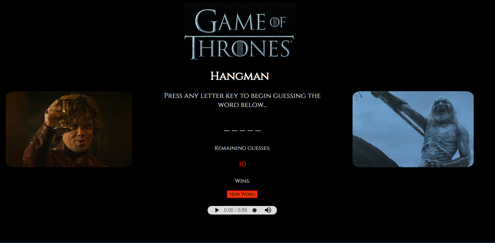

Word Guess Game
==========================================

A simple hangman style game that I made, the theme is Game of Thrones. The word will be randomly chosen (think Game of Thrones characters and places!) and you have to guess its letters.

## How to play
To play, simply enter in a letter with your keyboard, and the game will tell you whether the letter you guessed was a part of the word or not and adjust your score accordingly. Letters that area incorrect will be displayed below the blank word. If you run out of guesses, you lose, and the game will pick a new blank word for you to guess. 

+ _press the play button on the audio player for an enhanced experience_ ;)

## Technologies Used 
I wrote the contents of the page with HTML and some CSS for stylings, and for the game logic I used Javascript. 
